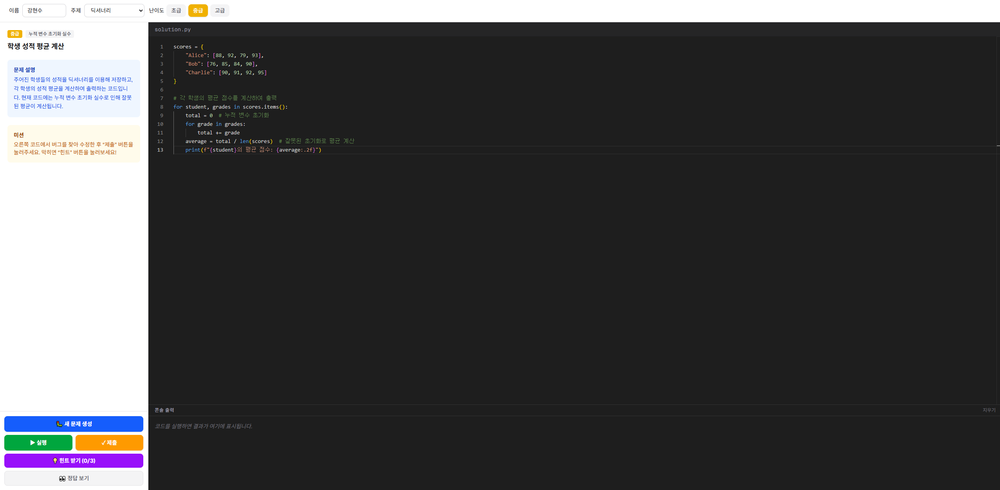
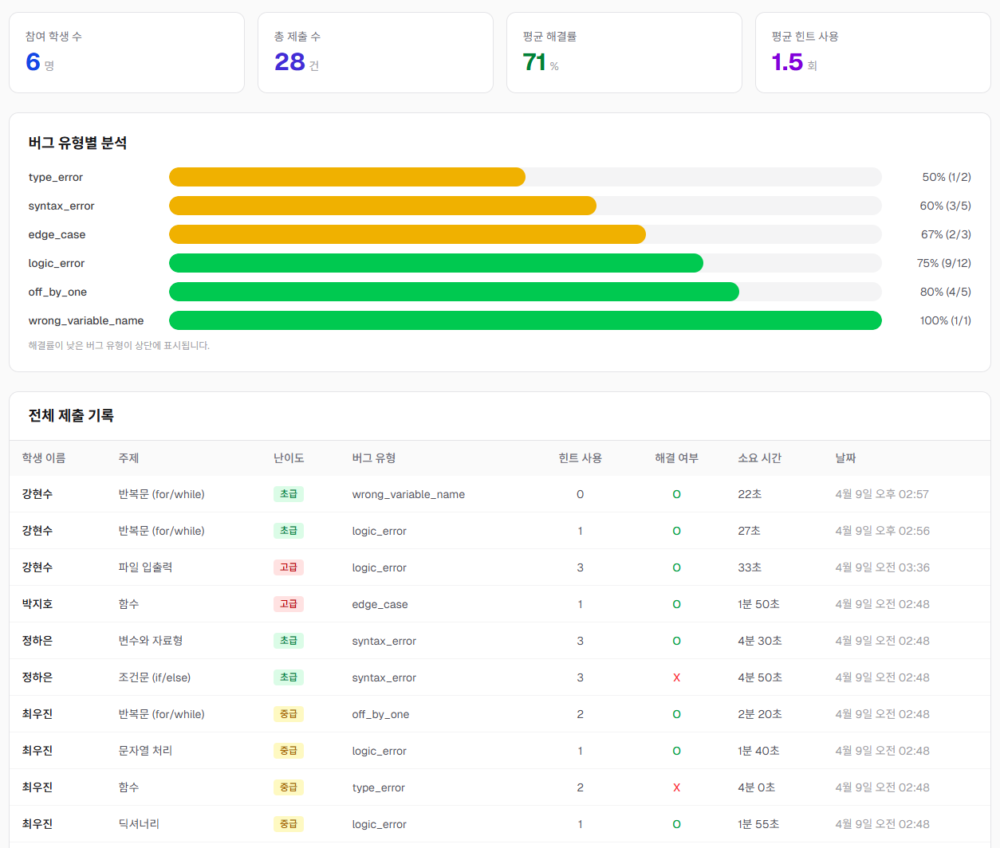
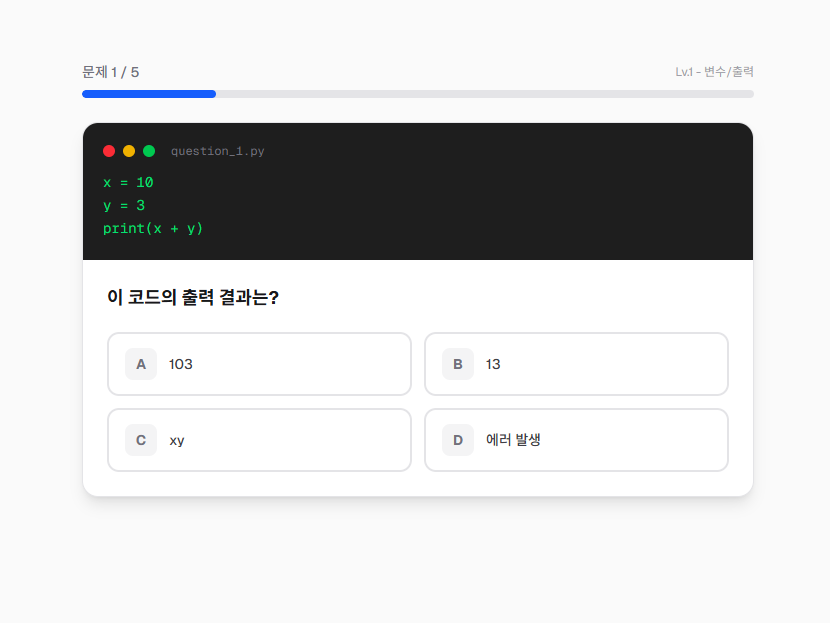

# BugHunter 🐛

> AI가 만든 버그를 찾아라! 디버깅으로 성장하는 코딩 교육 플랫폼

## 🌐 Live Demo
**[https://bughunter-lovat.vercel.app](https://bughunter-lovat.vercel.app)**

## 📸 스크린샷

### 랜딩 페이지
BugHunter의 메인 화면입니다. AI 디버깅 교육 플랫폼의 핵심 가치를 소개합니다.


### 디버깅 연습 화면
AI가 생성한 버그 코드를 읽고, 문제를 찾아 수정하는 메인 화면입니다.


### 강사 대시보드
학생별 풀이 현황, 버그 유형별 해결률, 전체 제출 기록을 한눈에 확인합니다.


### 레벨 진단 퀴즈
5문제를 풀고 초급/중급/고급 레벨을 자동으로 배정받습니다.


## 💡 프로젝트 소개

모든 코딩 교육은 코드 **짜는 법**을 가르칩니다. 하지만 실무 개발자의 60%는 코드 **고치는 법(디버깅)**에 시간을 사용합니다.

**BugHunter**는 AI가 학생 수준에 맞는 버그 코드를 생성하고, 3단계 힌트로 디버깅 사고력을 훈련시키는 교육 플랫폼입니다.

## 🎯 해결하려는 문제

| 문제 | 현실 |
|------|------|
| 수준 차이 | 30명 한 반에 전공자/비전공자 혼재, 강사 1명이 개별 피드백 불가 |
| 디버깅 교육 부재 | 코드 짜기만 배우고, 실무 핵심인 디버깅은 안 배움 |
| 높은 중도 탈락률 | 국비지원 교육 30~50% 이탈, 성장 체감 없이 포기 |

## ✨ 핵심 기능

### 1. AI 수준별 버그 생성
- GPT-4o가 주제/난이도별 의도적 버그 코드 생성
- 초급(문법 에러) → 중급(로직 에러) → 고급(엣지 케이스)

### 2. 3단계 AI 힌트 시스템
- 답을 주지 않고 사고 과정을 유도
- 1단계(방향) → 2단계(범위) → 3단계(거의 답)

### 3. 브라우저 내 Python 실행
- Pyodide 기반, 서버 없이 브라우저에서 코드 실행
- 즉각적인 피드백으로 학습 효과 극대화

### 4. 강사 대시보드
- 학생별 풀이 현황, 힌트 사용량, 버그 유형별 해결률
- AI가 25명을 대응, 강사는 도움 필요한 5명에 집중

### 5. 레벨 진단 & 성장 리포트
- 5문제 진단 퀴즈로 초급/중급/고급 자동 배정
- 주제별 강점/약점, 성장 추이 시각화

## 🏗️ 기술 스택

| 영역 | 기술 |
|------|------|
| Frontend | Next.js 16, TypeScript, Tailwind CSS |
| Code Editor | Monaco Editor |
| Python Runtime | Pyodide (브라우저 내 실행) |
| AI Engine | OpenAI GPT-4o |
| Database | Supabase (PostgreSQL) |
| Deployment | Vercel |

## 📁 프로젝트 구조

```
src/
├── app/
│   ├── page.tsx              # 랜딩 페이지
│   ├── practice/page.tsx     # 디버깅 연습
│   ├── quiz/page.tsx         # 레벨 진단 퀴즈
│   ├── report/page.tsx       # 성장 리포트
│   ├── teacher/page.tsx      # 강사 대시보드
│   └── api/
│       ├── generate-bug/     # AI 버그 생성
│       ├── get-hint/         # AI 힌트
│       ├── check-solution/   # AI 채점
│       └── submit-result/    # 결과 저장
├── lib/
│   ├── openai.ts            # OpenAI 클라이언트
│   ├── pyodide.ts           # Pyodide 런타임
│   └── supabase/            # Supabase 클라이언트
└── types/
```

## 🚀 실행 방법

```bash
# 1. 의존성 설치
npm install

# 2. 환경 변수 설정
cp .env.example .env.local
# OPENAI_API_KEY, NEXT_PUBLIC_SUPABASE_URL, NEXT_PUBLIC_SUPABASE_ANON_KEY 설정

# 3. 개발 서버 실행
npm run dev

# 4. 브라우저에서 열기
open http://localhost:3000
```

## 🔗 페이지 구성

| 페이지 | 경로 | 설명 |
|--------|------|------|
| 랜딩 | `/` | 서비스 소개 |
| 레벨 진단 | `/quiz` | 5문제 퀴즈로 레벨 배정 |
| 디버깅 연습 | `/practice` | AI 버그 생성 + 코드 에디터 + 힌트 |
| 성장 리포트 | `/report` | 학생별 성장 추적 |
| 강사 대시보드 | `/teacher` | 반 전체 현황 관리 |

## 📊 차별점

| | 프로그래머스/백준 | ChatGPT | BugHunter |
|---|---|---|---|
| 목표 | 코드 짜기 | 질문/답변 | **코드 고치기** |
| 피드백 | 맞다/틀리다 | 답을 바로 줌 | **사고 과정 유도** |
| 교육 맥락 | 없음 | 없음 | **수준별 맞춤** |
| 실무 연결 | 코딩테스트 | 없음 | **디버깅 역량** |

## 📝 공모전 정보

- **주제**: AI 활용 차세대 교육 솔루션
- **주최**: 코리아IT아카데미
- **개발자**: 강현수
